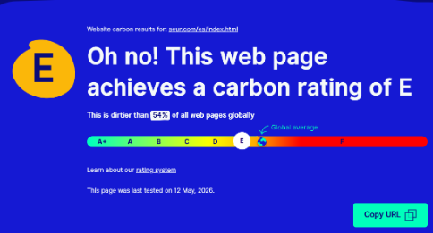

# INFORME DE AUDITORIA DE SOSTENIBILIDAD (ASG): [SEUR.COM](http://SEUR.COM)

Nombre y Apellidos: Alba Durán Bernal y [Roberto Heredia](mailto:robertoheredia.25@campuscamara.es)  
Módulo: Sostenibilidad Aplicada a los sectores productivos  
Ciclo: DAM  
Fecha de entrega: 19/05/2026

# 

# 

# 

# 

# 

# 

# 

# 

# 

# 

# 

# 

# 

# 

# Fase 1: Dimensión Ambiental (A)

1. ## Análisis ambiental

Utilizando herramientas como Website Carbon Calculator  y Lighthouse

Resultado: La página de inicio de SEUR emite aproximadamente 0.85g de CO2 por cada visita, entonces si muchas personas entran al día, la contaminación es alta   
Se encuentra en un rango intermedio, siendo más contaminante que el 54% de las webs analizadas, con un alto margen de mejora operativa.  

  

La **causa principal** de este desajuste es debido a:   
	-Nos encontramos ante fotos gigantes en formato JPEG en la página principal, las cuales no están comprimidas

	-Fragmentos de MP4 pesados que se reproducen de forma automática 

Esta inflación se justifica por la descarga de librerías JavaScript con activos visuales que no están optimizados por el posible dispositivo desde el que puede acceder el usuario, obligándolo a tener un procesamiento innecesario

2. # Análisis social

La web debe ser fácil de usar

**WEBGRAFÍA**  
[https://www.seur.com/es/sostenibilidad/](https://www.seur.com/es/sostenibilidad/)  
[https://www.websitecarbon.com/website/seur-com-es-index-html/](https://www.websitecarbon.com/website/seur-com-es-index-html/)  

